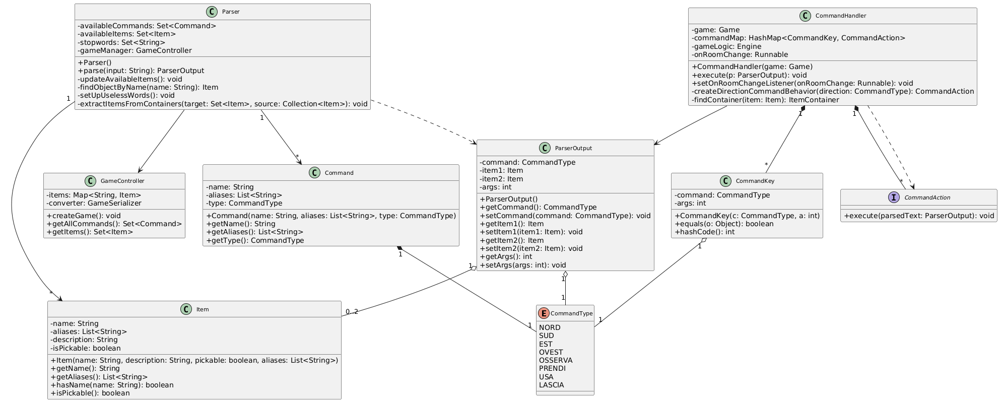

# La Casa di Cenere - Documentazione 

**Autori:** Raffaella Nitti, Aurora Marinelli  
**Corso:** Metodi Avanzati di Programmazione  
**Università:** Università degli Studi di Bari Aldo Moro  
**Anno Accademico:** 2025/2026

---

## Descrizione dell'avventura

"La Casa di Cenere" è un'avventura testuale-grafica ambientata in una misteriosa villa avvolta da un'atmosfera gotica e surreale. Dopo essersi rifugiato al suo interno per cercare riparo da una tempesta improvvisa, il protagonista scopre ben presto di essere rimasto intrappolato tra le sue mura.

Il giocatore deve esplorare cinque stanze interconnesse, ciascuna contenente enigmi e oggetti da scoprire. L'obiettivo finale è raccogliere tre oggetti rituali (candela, amuleto e diario) e portarli all'altare della cripta per completare un antico rituale che permetterà di liberare la casa dal suo peso secolare.

### Caratteristiche del gioco

#### 5 stanze da esplorare con passaggi bloccati da risolvere:
- **Stanza 1** - Ingresso
- **Stanza 2** - Salone
- **Stanza 3** - Biblioteca
- **Stanza 4** - Salone degli specchi
- **Stanza 5** - Cripta della cenere

#### 6 comandi d'azione:
- **Osserva** - Mostra la descrizione della stanza corrente
- **Osserva [oggetto]** - Mostra la descrizione di un oggetto specifico
- **Prendi [oggetto]** - Raccogliere un oggetto
- **Usa [oggetto]** - Usare un oggetto
- **Usa [oggetto1] con [oggetto2]** - Usa due oggetti insieme
- **Lascia [oggetto]** - Lascia un oggetto nella stanza corrente

#### Funzionalità aggiuntive:
- Sistema di inventario per gestire gli oggetti raccolti
- Enigmi logici incluso un mini-gioco degli specchi nella Stanza 4
- Interfaccia grafica realizzata con Swing con immagini per ogni stanza
- Database H2 per memorizzare le descrizioni dinamiche
- Sistema di salvataggio/caricamento tramite file JSON
- Server REST per visualizzare i crediti del gioco

---

## Progettazione

Il progetto è organizzato seguendo il paradigma Object-Oriented e il pattern MVC (Model-View-Controller) con una chiara separazione delle responsabilità:

### Package model
Contiene le classi che rappresentano le entità del gioco:
- **Game**: classe singleton che rappresenta lo stato globale del gioco
- **Room**: rappresenta una stanza con nome, descrizione e oggetti
- **Item** e **ItemContainer**: gerarchia per gli oggetti di gioco
- **Command**: rappresenta i comandi disponibili
- **RoomConnection**: modella i collegamenti direzionali tra stanze

### Package controller
Gestisce la logica di gioco e l'elaborazione dei comandi:
- **Parser**: analizza l'input testuale dell'utente
- **CommandHandler**: esegue i comandi usando il pattern Strategy
- **Engine**: contiene la logica specifica del gioco (uso oggetti, puzzle)
- **GameController**: coordina inizializzazione, salvataggio e caricamento

### Package view
Componenti dell'interfaccia grafica:
- **MainFrame**: frame principale con gestione CardLayout
- **MenuPanel**: menu principale
- **GamePanel**: pannello di gioco con area testo, inventario e immagini
- **HelpDialog**: finestra di aiuto
- **MapDialog**: finestra con la mappa interattiva

### Package service
Servizi di supporto:
- **InputService**: gestisce il flusso di input e gli eventi speciali
- **OutputService**: formatta e visualizza il testo con word wrapping
- **GameFlowController**: gestisce l'input asincrono dell'utente
- **MirrorGame**: implementa il mini-gioco degli specchi

### Package database
Gestione della persistenza:
- **DatabaseH2**: connessione e query al database H2

### Package server
Server REST:
- **RestServer**: avvia il server Grizzly
- **CreditsHandler**: gestisce l'endpoint /api/credits

### Package util
Classi di utilità:
- **GameSerializer**: serializzazione/deserializzazione JSON
- **GameInitializer**: inizializzazione iniziale del gioco
- **ItemDeserializer**: deserializzatore custom per oggetti
- **TextAnimator**: animazione del testo carattere per carattere
- **Music**: gestione audio

### Package type
Enumerazioni e tipi:
- **CommandType**: enum dei tipi di comando
- **CommandKey**: chiave per la mappa dei comandi
- **CommandAction**: interfaccia funzionale per i comportamenti
- **ParserOutput**: output del parser

---

## 1. Diagramma delle Classi

### Diagramma del Sistema di Parsing dei Comandi

Questo diagramma rappresenta il flusso di elaborazione di un comando testuale inserito dall'utente.




### Descrizione del funzionamento:

#### 1. Parser
Il **Parser** è il cuore del sistema: riceve l'input testuale dell'utente (es. "prendi candela") e lo analizza.

**Attributi principali:**
- `availableCommands`: tutti i comandi disponibili nel gioco (nord, sud, prendi, usa,...)
- `availableItems`: tutti gli oggetti presenti nel gioco
- `stopwords`: parole da ignorare (il, la, un, di,...)
- `gameManager`: riferimento al controller del gioco

**Metodo chiave:**
- `parse(input: String): ParserOutput` → analizza la stringa e restituisce un oggetto

#### 2. Command
**Command** rappresenta un singolo comando del gioco.

Il Parser confronta la prima parola dell'input con i nomi ed alias di tutti i Command per identificare cosa vuole fare l'utente.

**Attributi:**
- `name: String` - Nome del comando
- `aliases: List<String>` - Alias alternativi
- `type: CommandType` - Tipo enumerato

#### 3. CommandType
**CommandType** è l'enumerazione che definisce tutti i possibili comandi:

**Movimento:**
- `NORD`, `SUD`, `EST`, `OVEST`

**Azioni:**
- `OSSERVA`, `PRENDI`, `USA`, `LASCIA`

#### 4. Item
**Item** rappresenta un oggetto presente nel gioco.

**Attributi:**
- `name: String` - Nome dell'oggetto
- `description: String` - Descrizione
- `isPickable: boolean` - Se può essere raccolto
- `aliases: List<String>` - Nomi alternativi

Il Parser usa questi dati per riconoscere gli oggetti nominati dall'utente.

#### 5. ParserOutput
**ParserOutput** è il prodotto finale del Parser. Contiene:
- `command: CommandType` - Comando identificato (es. PRENDI)
- `item1: Item` - Primo oggetto identificato (es. Candela)
- `item2: Item` - Secondo oggetto (opzionale, per comandi come "usa X con Y")
- `args: int` - Numero di argomenti (0, 1, o 2)

#### 6. CommandHandler
**CommandHandler** riceve il ParserOutput ed esegue l'azione corrispondente.

**Funzionamento:**
1. Crea una `CommandKey` combinando `CommandType` + numero di args
2. Usa questa chiave per cercare nella `commandMap`
3. Recupera il `CommandAction` associato
4. Esegue l'azione

#### 7. CommandKey
**CommandKey** combina:
- `command: CommandType` - Tipo di comando
- `args: int` - Numero di argomenti

Serve per differenziare comandi con lo stesso tipo ma diverso numero di argomenti:
- `OSSERVA` con 0 args → osserva la stanza
- `OSSERVA` con 1 arg → osserva un oggetto specifico

#### 8. CommandAction
**CommandAction** è l'interfaccia funzionale con un solo metodo:
- `execute(parsedText: ParserOutput): void`

Ogni comando implementa questa interfaccia (tramite lambda) con la logica specifica dell'azione.

---

## Principi OOP Utilizzati

### 1. Ereditarietà
- **ItemContainer** estende **Item**, ereditando proprietà base e aggiungendo la capacità di contenere altri oggetti
- Permette di trattare contenitori come oggetti normali quando appropriato

### 2. Polimorfismo
- Gli oggetti **Item** e **ItemContainer** possono essere trattati polimorficamente nelle liste di oggetti
- Il metodo `execute()` dell'interfaccia **CommandAction** viene implementato in modi diversi per ogni comando

### 3. Incapsulamento
- Tutti gli attributi delle classi sono privati con metodi getter/setter pubblici
- La logica interna è nascosta, esponendo solo interfacce necessarie
- Esempio: **Game** nasconde la gestione dell'inventario e delle stanze

### 4. Pattern Singleton
- **Game** e **MirrorGame** usano il pattern Singleton per garantire un'unica istanza globale
- Evita duplicazioni dello stato di gioco
- L'istanza di Game è inizializzata staticamente (`private static Game game = new Game()`), garantendo thread-safety senza necessità di sincronizzazione

### 5. Pattern Strategy
- **CommandAction** è un'interfaccia funzionale che definisce il comportamento dei comandi
- **CommandHandler** usa una `HashMap<CommandKey, CommandAction>` per associare comandi a comportamenti
- Permette di aggiungere nuovi comandi senza modificare la struttura esistente

### 6. Composizione
- **Game** contiene liste di Item, Room e RoomConnection
- **Room** contiene liste di Item
- **ItemContainer** contiene una lista di Item
- Preferita all'ereditarietà per creare relazioni flessibili

### 7. Interfacce Funzionali
- **CommandAction** permette l'uso di lambda expressions per definire comportamenti
- **JsonDeserializer** è un'interfaccia funzionale per la deserializzazione custom

---

## 2. Specifica Algebrica

### Specifica Algebrica della Lista

#### Specifica Sintattica

**Tipi:** List, Item, Integer, Boolean

**Operatori:**

| Operatore | Descrizione |
|-----------|-------------|
| `newList() -> List` | crea una nuova lista vuota |
| `add(List, Item, Integer) -> List` | aggiunge un elemento alla lista nella posizione specificata |
| `isEmpty(List) -> Boolean` | restituisce true se la lista è vuota; altrimenti false |
| `getLastIndex(List) -> Integer` | restituisce l'ultima posizione occupata da un elemento |
| `getIndex(List, Item) -> Integer` | restituisce la posizione dell'elemento specificato |
| `getItem(List, Integer) -> Item` | restituisce l'elemento nella posizione specificata |
| `remove(List, Integer) -> List` | rimuove dalla lista l'elemento nella posizione specificata |
| `contains(List, Item) -> Boolean` | restituisce true se l'elemento specificato è contenuto nella lista |

> **Nota:** Item è un tipo generico, che può essere sostituito con qualsiasi altro tipo di dato. Integer e Boolean sono tipi ausiliari alla definizione della specifica algebrica della lista.

#### Costruttori di l'

**Osservazioni:**

| Osservazione | newList | add(l, it, id) |
|--------------|---------|----------------|
| `isEmpty(l')` | true | false |
| `getLastIndex(l')` | error | if isEmpty(l) then 1 else getLastIndex(l) + 1 |
| `getIndex(l', it')` | error | if it = it' then id else getIndex(l, it') |
| `getItem(l', id')` | error | if id = id' then it else getItem(l, id') |
| `remove(l', id')` | error | if id = id' then l else add(remove(l, id'), it, id) |
| `contains(l', it')` | false | if it = it' then true else contains(l, it') |

#### Specifica Semantica

**DECLARE:**
- l, l' : List
- it, it' : Item
- id, id' : Integer

**OPERATIONS:**
- `isEmpty(newList) = true`
- `isEmpty(add(l, it, id)) = false`
- `getLastIndex(add(l, it, id)) = if isEmpty(l) then 1 else getLastIndex(l) + 1`
- `getIndex(add(l, it, id), it') = if it = it' then id else getIndex(l, it')`
- `getItem(add(l, it, id), id') = if id = id' then it else getItem(l, id')`
- `remove(add(l, it, id), id') = if id = id' then l else add(remove(l, id'), it, id)`
- `contains(newList, it') = false`
- `contains(add(l, it, id), it') = if it = it' then true else contains(l, it')`

#### Specifica di Restrizione

**RESTRICTIONS:**
- `getLastIndex(newList) = error`
- `getIndex(newList, it') = error`
- `getItem(newList, id') = error`
- `remove(newList, id') = error`

---

### Specifica Algebrica della Mappa

#### Specifica Sintattica

**Tipi:** Map, Key, Value, Boolean, Integer

**Operatori:**

| Operatore | Descrizione |
|-----------|-------------|
| `newMap() -> Map` | crea una nuova mappa vuota |
| `isEmpty(Map) -> Boolean` | restituisce true se la mappa è vuota; false altrimenti |
| `put(Map, Key, Value) -> Map` | aggiunge una coppia chiave-valore alla mappa, o, se già presente, ne aggiorna il valore |
| `get(Map, Key) -> Value` | restituisce il valore associato alla chiave specificata |
| `containsKey(Map, Key) -> Boolean` | restituisce true se la chiave specificata è presente nella mappa |
| `containsValue(Map, Value) -> Boolean` | restituisce true se il valore specificato è presente nella mappa |
| `remove(Map, Key) -> Map` | rimuove la chiave ed il valore associato ad essa dalla mappa |
| `size(Map) -> Integer` | restituisce il numero di coppie chiave-valore presenti nella mappa |

#### Costruttori di m'

**Osservazioni:**

| Osservazione | newMap | put(m, k, v) |
|--------------|--------|--------------|
| `isEmpty(m')` | true | false |
| `containsKey(m', k')` | false | if k = k' then true else containsKey(m, k') |
| `containsValue(m', v')` | false | if v = v' then true else containsValue(m, v') |
| `get(m', k')` | error | if k = k' then v else get(m, k') |
| `remove(m', k')` | error | if k = k' then m else put(remove(m, k'), k, v) |
| `size(m')` | 0 | if isEmpty(m) then 1 else size(m) + 1 |

#### Specifica Semantica

**DECLARE:**
- m, m': Map
- k, k': Key
- v, v': Value

**OPERATIONS:**
- `isEmpty(newMap) = true`
- `isEmpty(put(m, k, v)) = false`
- `containsKey(newMap, k') = false`
- `containsKey(put(m, k, v), k') = if k = k' then true else containsKey(m, k')`
- `containsValue(newMap, v') = false`
- `containsValue(put(m, k, v), v') = if v = v' then true else containsValue(m, v')`
- `get(put(m, k, v), k') = if k = k' then v else get(m, k')`
- `remove(put(m, k, v), k') = if k = k' then m else put(remove(m, k'), k, v)`
- `size(newMap) = 0`
- `size(put(m, k, v)) = size(m) + 1`

#### Specifica di Restrizione

**RESTRICTIONS:**
- `get(newMap, k') = error`
- `remove(newMap, k') = error`

> Queste specifiche algebriche descrivono formalmente il comportamento delle strutture dati Lista e Mappa utilizzate nell'implementazione del nostro gioco "La Casa di Cenere". Le operazioni definite corrispondono alle funzionalità implementate tramite le classi ArrayList e HashMap di Java.

---

## 3. Dettagli Implementativi

### 1. Programmazione Generica

Il progetto fa uso estensivo dei **generics** forniti dal Java Collections Framework per garantire type safety e riusabilità del codice. L'utilizzo dei generics elimina la necessità di cast espliciti e fornisce controlli di tipo a compile-time, prevenendo errori a runtime.

#### Principali strutture dati generiche utilizzate:

- `List<Item>` - per gestire inventario, oggetti nelle stanze e contenuti dei container
- `Set<Item>` - per garantire unicità degli oggetti disponibili
- `Map<String, Item>` - per assegnare nomi univoci agli oggetti e permettere ricerche efficienti
- `HashMap<CommandKey, CommandAction>` - per mappare comandi alle loro implementazioni usando il pattern Strategy
- `Set<Command>` - per gestire l'insieme dei comandi disponibili nel gioco
- `List<RoomConnection>` - per rappresentare la mappa dei collegamenti tra le stanze
- `List<String>` - per gli alias di oggetti e comandi

#### ItemContainer: Pattern Composite

È stata implementata la classe **ItemContainer** che estende **Item** e permette di creare oggetti contenitori (come lo Scrigno nel gioco):

```java
public class ItemContainer extends Item {
    private List<Item> list = new ArrayList<>();
    
    public void add(Item item) {
        list.add(item);
    }
    
    public void remove(Item item) {
        list.remove(item);
    }
    
    public List<Item> getList() {
        return list;
    }
}
```

Questa implementazione:
- Realizza il **pattern Composite** permettendo agli Item di contenere altri Item
- Utilizza `List<Item>` (generics del framework) per la gestione interna
- Permette di gestire oggetti come scrigni, borse, contenitori in modo uniforme

---

### 2. File

Il progetto gestisce il salvataggio e il caricamento dello stato di gioco attraverso la **serializzazione JSON**, offrendo maggiore flessibilità e leggibilità rispetto alla serializzazione Java standard.

Questa funzionalità è implementata attraverso la classe **GameSerializer**, che si basa sulla libreria **Gson** di Google per la conversione tra oggetti Java e formato JSON.

#### Funzionamento

La classe converte lo stato del gioco (Game e relativi Item) nei file:
- `LoadedGame.json`
- `LoadedItems.json`

E li ricostruisce al momento del caricamento.

#### Metodi principali:

**1. processJsonFiles**
```java
private Map<String, Item> processJsonFiles(String gameFilePath, String itemsFilePath)
```
Legge i file JSON passati come parametri e li restituisce in formato Java, creando un oggetto di tipo Map contenente tutti gli oggetti presenti nel gioco ed inizializzando il gioco.

**2. convertGameToJson**
```java
public void convertGameToJson()
```
Converte l'oggetto Game in formato JSON.

**3. convertItemsToJson**
```java
public void convertItemsToJson()
```
Converte gli oggetti di tipo Item in formato JSON, salvando solo gli oggetti che non sono presenti nell'inventario o in una stanza.

#### ItemDeserializer Custom

Dato che il nostro gioco contiene una gerarchia complessa di oggetti (come Item e ItemContainer), abbiamo registrato un **ItemDeserializer** personalizzato:

```java
public class ItemDeserializer implements JsonDeserializer<Item> {
    @Override
    public Item deserialize(JsonElement json, Type typeOfT, 
                           JsonDeserializationContext context) {
        JsonObject obj = json.getAsJsonObject();
        
        if (obj.has("list")) {
            // Deserializza come ItemContainer
            ItemContainer container = new ItemContainer(...);
            // ...
            return container;
        }
        
        // Deserializza come Item normale
        return new Item(...);
    }
}
```

Questo garantisce la corretta ricostruzione delle classi derivate durante la deserializzazione. Questo livello di controllo non sarebbe stato ottenibile con la semplice interfaccia `java.io.Serializable`.

---

### 3. Database (JDBC)

Il gioco utilizza un database relazionale **H2** per la gestione della sua struttura statica. La scelta di H2 è strategica in quanto si tratta di un database embedded, il che significa che:

- Il database è un semplice file locale che viene distribuito insieme all'applicazione
- Non richiede l'installazione di server esterni o configurazioni complesse

#### Classe DatabaseH2

La gestione della connessione e delle operazioni è centralizzata nella classe **DatabaseH2**, la quale:

- Definisce le costanti per il driver JDBC, l'URL del database, l'utente e la password per la connessione
- Implementa metodi per la connessione al database, la creazione delle tabelle, l'inserimento e la lettura dei dati

#### Metodi principali:

**1. connect()**
```java
public static Connection connect()
```
Stabilisce la connessione al database H2 e si occupa dell'inizializzazione delle tabelle e del popolamento iniziale dei dati se il database è vuoto.

**2. close()**
```java
public static void close(Connection conn)
```
Si occupa di chiudere la connessione al database.

**3. printFromDB()**
```java
public static void printFromDB(String comando, String stanza, String stato, 
                               String oggetto1, String oggetto2)
```
Stampa la descrizione di un elemento (comando, stanza, stato, oggetto1, oggetto2) ed utilizza una **PreparedStatement** per eseguire una query altamente specifica sulla tabella DESCRIZIONE in base a cinque parametri forniti.

```java
String query = "SELECT DESCRIZIONE FROM DESCRIZIONE WHERE " +
               "COMANDO = ? AND STANZA = ? AND STATO = ? AND " +
               "OGGETTO1 = ? AND OGGETTO2 = ?";
```

> **Nota:** Il metodo `printFromDB()` apre e chiude una connessione per ogni query. Questa scelta è stata fatta per semplicità, dato che le query sono poco frequenti. In un'applicazione con molte query concorrenti, sarebbe preferibile utilizzare un connection pool.

#### Vantaggi dell'adozione di H2 e JDBC:

- **Separazione Dati-Logica**: La struttura statica del gioco, come le descrizioni delle stanze e le interazioni complesse, è separata dalla logica di gioco in Java
- **Gestione Contenuti**: Facilita la modifica e l'aggiunta di nuovi contenuti narrativi (nuove descrizioni, reazioni a comandi) senza alterare il codice
- **Persistenza Strutturale**: Garantisce che la configurazione di base del gioco (nomi delle stanze, collegamenti iniziali, descrizioni base) sia persistente e caricata in modo coerente all'avvio

---

### 4. Lambda Expressions

Le **lambda expressions** sono state utilizzate in vari punti del progetto per rendere il codice più conciso e leggibile. Di seguito i casi più significativi:

#### 1. CommandHandler

Nella classe **CommandHandler**, le lambda expressions sono state utilizzate per definire i comportamenti dei comandi attraverso l'interfaccia funzionale **CommandAction**:

```java
commandMap.put(new CommandKey(CommandType.PRENDI, 1),
    p -> {
        if (game.getInventory().contains(p.getItem1())) {
            OutputService.displayText("Hai già " + p.getItem1().getName());
            return;
        }
        
        if (game.getCurrentRoom().getItems().contains(p.getItem1())) {
            if (p.getItem1().isPickable()) {
                game.addInventory(p.getItem1());
                game.getCurrentRoom().removeItem(p.getItem1().getName());
                OutputService.displayText("Hai raccolto " + p.getItem1().getName());
            } else {
                OutputService.displayText(p.getItem1().getName() + " non può essere raccolto.");
            }
        }
    });
```

L'interfaccia funzionale **CommandAction** definisce un singolo metodo astratto che accetta un **ParserOutput**, permettendo l'uso di lambda expressions per implementazioni concise dei vari comandi di gioco.

```java
@FunctionalInterface
public interface CommandAction {
    void execute(ParserOutput parsedText);
}
```

#### 2. Parser

Nel **Parser**, per la ricerca di comandi ed oggetti:

```java
for (Command command : availableCommands) {
    if (command.getName().equalsIgnoreCase(words[0]) ||
        command.getAliases().stream()
               .anyMatch(alias -> alias.equalsIgnoreCase(words[0]))) {
        output.setCommand(command.getType());
        output.setArgs(0);
        break;
    }
}
```

#### 3. GameController

Nella classe **GameController**, per l'aggregazione di oggetti da tutte le istanze:

```java
Set<Room> rooms = game.getCorridorMap().stream()
        .flatMap(c -> Stream.of(c.getStartingRoom(), c.getArrivingRoom()))
        .filter(Objects::nonNull)
        .collect(Collectors.toSet());
```

#### 4. Game

Nella classe **Game**, per la conversione dell'inventario in array di stringhe:

```java
List<String> itemsNames = game.getInventory().stream()
        .map(Item::getName)
        .toList();
String[] itemsNamesArray = itemsNames.toArray(new String[0]);
```

#### Utilizzo in Swing e Thread

Le lambda expressions sono state utilizzate anche per semplificare notevolmente la gestione degli eventi in Swing e per creare e gestire thread in modo più leggibile:

```java
newGameButton.addActionListener(evt -> {
    gameManager.createGame();
    Game game = Game.getInstance();
    new Thread(() -> InputService.setUpGameFlow(game)).start();
});
```

#### Benefici dell'adozione delle Lambda Expressions:

1. **Codice più conciso**: Eliminazione di classi anonime verbose, specialmente negli event listener di Swing
2. **Leggibilità migliorata**: Le operazioni su stream risultano più dichiarative e intuitive
3. **Manutenibilità**: La logica dei comandi è centralizzata e facilmente modificabile nella commandMap
4. **Programmazione funzionale**: Maggiore espressività nel trattamento delle collezioni con le Stream API
5. **Riduzione boilerplate**: Meno codice ripetitivo nella gestione di thread ed eventi

---

### 5. SWING

Il progetto è stato sviluppato interamente come applicazione desktop, e per la realizzazione dell'interfaccia grafica (GUI) abbiamo utilizzato il framework **Java Swing**.

#### 1. MainFrame - Frame principale

La classe **MainFrame**, che estende `JFrame`, rappresenta il contenitore principale dell'applicazione che utilizza un **CardLayout** per gestire la transizione tra il menu principale ed il pannello di gioco.

```java
public class MainFrame extends JFrame {
    public static GamePanel game;
    
    public MainFrame() {
        setDefaultCloseOperation(WindowConstants.EXIT_ON_CLOSE);
        setTitle("La Casa di Cenere");
        setPreferredSize(new Dimension(800, 600));
        setResizable(false);
        
        JPanel cards = new JPanel(new CardLayout());
        MenuPanel menu = new MenuPanel();
        game = new GamePanel();
        
        cards.add(menu, "MenuPanel");
        cards.add(game, "GamePanel");
        
        add(cards);
        pack();
        setLocationRelativeTo(null);
        setVisible(true);
    }
}
```

Questo layout agisce come una pila di schede, permettendo di mostrare solo un pannello alla volta.

#### 2. MenuPanel - Menu principale

La classe **MenuPanel**, che estende `JPanel`, presenta il menu iniziale con sfondo personalizzato e pulsanti stilizzati.

```java
backgroundPanel = new JPanel() {
    @Override
    protecte